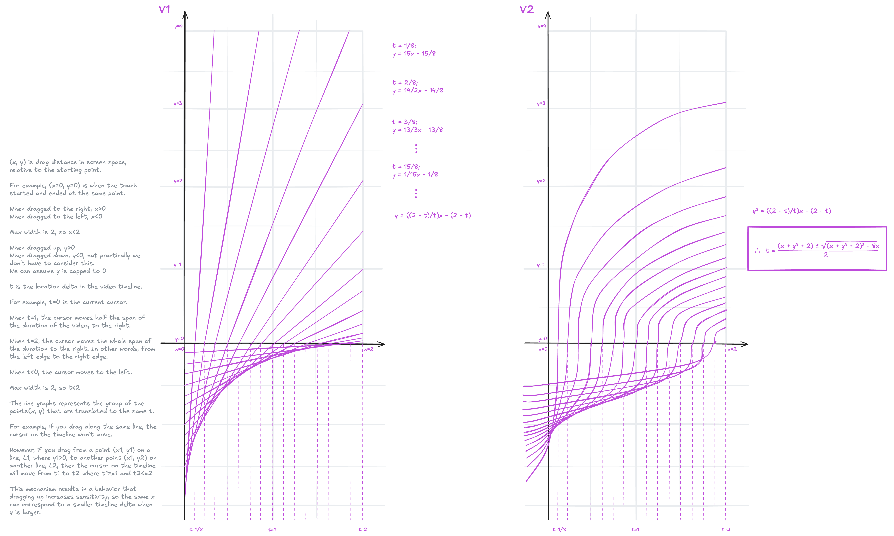

# Scrub Gesture Calculation Design

## Overview

Turnip's scrub controls — Processing's playback bar and the clip editor's trim timeline — use a 2D drag gesture to control timeline scrubbing.

The core behavior is:

- Horizontal movement controls the direction and amount of scrubbing.
- Dragging upward reduces horizontal sensitivity.
- Dragging downward does not affect sensitivity.
- Horizontal dragging can scrub through the entire video, including past the `t = 1` point.
- The mathematical model is symmetric between left and right dragging.
- All coordinate normalization and mathematical calculations belong to the calculation layer, not the SwiftUI caller.

The calculation layer must be UI-agnostic. It should not depend on SwiftUI, `DragGesture`, `AVPlayer`, `CMTime`, or any other UI/video framework.

## Coordinate Model

The calculator internally uses normalized screen-space coordinates.

Given:

```swift
translation: CGSize
viewportSize: CGSize
```

normalize both axes using half the viewport width — not the full width — so that a
single edge-to-edge drag across the viewport reaches `x = 2`, not `x = 1`:

```text
x = translation.width / (viewportWidth / 2)
y = -translation.height / (viewportWidth / 2)
```

The negative sign on `y` converts SwiftUI screen coordinates into the mathematical coordinate system:

```text
                 +y
                  ↑
                  |
                  |
      -x <--------+--------> +x
                  |
                  |
```

Therefore:

- `x > 0`: dragged right
- `x < 0`: dragged left
- `y > 0`: dragged upward
- `y < 0`: dragged downward

Using half the viewport width as the normalization unit means:

- `x = 1` = half a screen-width horizontal drag
- `x = 2` = one full screen-width horizontal drag (edge-to-edge)
- `y = 1` = half a screen-width vertical drag

The caller should not perform this normalization.

## Timeline Parameter

The mathematical model uses a parameter `t`.

`t` is not directly a time value.

It represents a normalized timeline displacement:

```text
t = 0    → 0% of video duration
t = 1    → 50% of video duration
t = 2    → 100% of video duration
```

Therefore:

```swift
timelineFraction = t / 2
```

For example:

```text
t = 0.5 → 25% of video duration
t = 1.0 → 50% of video duration
t = 1.5 → 75% of video duration
t = 2.0 → 100% of video duration
```

The sign of `t` represents direction:

```text
positive → forward
negative → backward
```

The mathematical calculation can operate on `abs(x)` and restore the sign afterward.

## Desired Behavior

### 1. No upward drag

When:

```text
y <= 0
```

the scrub should be directly proportional to horizontal movement:

```text
t = x
```

Therefore:

```text
x = 0.25 → t = 0.25
x = 1.00 → t = 1.00
x = 1.50 → t = 1.50
x = 2.00 → t = 2.00
```

`t = 1` is not a maximum scrub position.

The user must be able to scrub from `t = 0` through `t = 2` while dragging horizontally in the lower portion of the screen.

### 2. Upward drag

When:

```text
y > 0
```

the horizontal sensitivity is reduced.

For a fixed horizontal displacement `x`:

```text
increasing y → decreasing t
```

In other words, dragging farther upward makes the scrub more precise.

### 3. Left/right symmetry

The mathematical model only needs to calculate the magnitude of the scrub.

Use:

```swift
magnitudeX = abs(x)
```

Then restore the direction:

```swift
direction = x < 0 ? -1 : 1
```

Therefore the same calculation works for either direction.

## Mathematical Model



For upward dragging, the design defines the relationship:

```text
y³ = ((2 - t) / t) * x - (2 - t)
```

Cubing `y` (rather than using it directly) eases the transition off the horizontal: for
`y < 1` the precision drop-off is gentler than a plain-`y` model would give (small upward
drags barely reduce sensitivity), while for `y > 1` it is steeper (`t` falls off faster the
further up the drag goes).

Substituting `Y = y³` reduces this to the same shape as the plain-`y` line equation, so the
rest of the derivation goes through unchanged with `Y` in place of `y`.

Rearranging:

```text
tY = (2 - t)(x - t)
```

Expanding:

```text
tY = 2x - 2t - xt + t²
```

Therefore:

```text
t² - (x + Y + 2)t + 2x = 0
```

i.e.

```text
t² - (x + y³ + 2)t + 2x = 0
```

Applying the quadratic formula:

```text
t = ((x + y³ + 2) ± sqrt((x + y³ + 2)² - 8x)) / 2
```

There are therefore two mathematical solutions.

## Root Selection

The two roots represent two different mathematical branches.

```text
t₋ = ((x + y³ + 2) - sqrt((x + y³ + 2)² - 8x)) / 2

t₊ = ((x + y³ + 2) + sqrt((x + y³ + 2)² - 8x)) / 2
```

For the intended upward-scrubbing behavior, use the smaller root:

```text
t = t₋
```

For this root:

```text
dt/dy < 0
```

Therefore increasing vertical displacement decreases the scrub amount.

The larger root has:

```text
dt/dy > 0
```

which would make upward dragging increase the scrub amount. That is contrary to the intended UX.

## Why `t = 2` Is Not a Scrubbing Limit

The equation has two roots because the line equation describes two mathematical branches.

At:

```text
y = 0
```

the equation becomes:

```text
0 = (2 - t)(x/t - 1)
```

which gives:

```text
t = 2
```

or:

```text
t = x
```

For:

```text
0 <= x <= 2
```

the smaller root is:

```text
t = x
```

For:

```text
x > 2
```

the `t = x` solution becomes the larger root.

The larger-root branch corresponds to:

```text
slope = (2 - t) / t < 0
```

when `t > 2`.

Those negative-slope lines are intentionally not used for upward scrubbing.

This does not mean that `t > 2` is invalid.

Instead:

- `y <= 0`: `t = x`, allowing `t` to go all the way to `2`
- `y > 0`: use the smaller-root branch
- the negative-slope `t > 2` branch is ignored

## Piecewise Definition

The complete current mathematical behavior is:

```text
                         x = abs(horizontal)
                         y = max(normalizedY, 0)

t(x, y) =
    x                                                if y <= 0

    (x + y³ + 2
       - sqrt((x + y³ + 2)² - 8x)) / 2               if y > 0
```

Then restore the horizontal direction:

```text
signedT = sign(horizontal) * t
```

Finally clamp to the supported gesture range:

```text
-2 <= signedT <= 2
```

## Important Boundary Behavior

There is one intentional mathematical discontinuity in the current model.

For:

```text
x > 2
```

at exactly:

```text
y = 0
```

the lower-region rule produces:

```text
t = x
```

For example:

```text
x = 2.5
y = 0

t = 2.5
```

But immediately after entering the upward region, the smaller-root branch approaches `t = 2`:

```text
x = 2.5
y → 0+

t → 2
```

Therefore the current model has a discontinuity when crossing from `y <= 0` to `y > 0` for `x > 2`.

This is a known property of the chosen mathematical model, not a numerical implementation bug.

Do not attempt to fix this by switching to the larger root. Doing so would make upward movement increase `t`: the larger root grows with `y` for every `x > 0`.

If this boundary behavior proves undesirable during interaction testing, it should be addressed by changing the mathematical model rather than by hiding the discontinuity in the implementation.

## Public API

The calculation API should hide all normalization and mathematical details from the caller.

```swift
enum ScrubCalculator {
    /// Signed normalized timeline displacement.
    ///
    /// -2 = one full duration backward, 0 = no movement, +2 = one full duration forward.
    struct Result {
        let timelineDelta: Double
    }

    static func calculate(translation: CGSize, viewportSize: CGSize) -> Result
}
```

The SwiftUI caller should only need:

```swift
let result = ScrubCalculator.calculate(
    translation: value.translation,
    viewportSize: geometry.size
)
```

The caller should not need to know:

- how coordinates are normalized
- that half the viewport width is used as the normalization unit
- that `y` is inverted
- that `abs(x)` is used
- that a quadratic equation is involved
- which quadratic root is selected
- where `t = 1` comes from
- how the result is clamped

## Implementation

`Turnip/Media/ScrubCalculator.swift`, with its doc comments abridged:

```swift
import CoreGraphics
import Foundation

enum ScrubCalculator {
    private static let maximumTimelineDelta = 2.0

    /// Signed normalized timeline displacement.
    ///
    /// -2 = one full duration backward, 0 = no movement, +2 = one full duration forward.
    struct Result {
        let timelineDelta: Double
    }

    static func calculate(translation: CGSize, viewportSize: CGSize) -> Result {
        guard viewportSize.width > 0 else { return Result(timelineDelta: 0) }

        // Half the viewport width is the unit, so an edge-to-edge drag reaches x = 2.
        let unit = Double(viewportSize.width) / 2
        let x = Double(translation.width) / unit
        let y = Double(-translation.height) / unit

        let direction: Double = x < 0 ? -1 : 1
        // Downward movement does not affect sensitivity.
        let magnitude = calculateNormalized(horizontal: abs(x), vertical: max(y, 0))

        let signed = direction * magnitude
        return Result(timelineDelta: min(max(signed, -maximumTimelineDelta), maximumTimelineDelta))
    }

    static func calculateNormalized(horizontal x: Double, vertical y: Double) -> Double {
        // Direct horizontal scrubbing.
        guard y > 0 else { return x }

        // Upward scrubbing: the smaller root of t² - (x + y³ + 2)t + 2x = 0.
        let bCoefficient = x + y * y * y + 2
        let discriminant = max(0, bCoefficient * bCoefficient - 8 * x)
        return max(0, (bCoefficient - discriminant.squareRoot()) / 2)
    }
}
```

A slightly negative discriminant from floating-point error is clamped to zero rather than
rejected, and the clamp to `-2...2` is written inline.

## Converting the Result to Video Time

`ScrubCalculator` stays independent of video duration.

Each caller converts the result to time inline, as a fraction of the span its track
represents:

```swift
let newTime = dragStartTime + result.timelineDelta / 2 * span
```

For example:

```text
timelineDelta =  2.0 → +100% of the span
timelineDelta =  1.0 → +50% of the span
timelineDelta =  0.5 → +25% of the span
timelineDelta = -1.0 → -50% of the span
```

The two callers:

- **`VideoScrubBar`** (`Turnip/Media/VideoScrubBar.swift`, Processing's playback bar):
  the span is the whole video's `duration`, and the result is clamped to
  `0...duration` before the seek.
- **`TrimSliderView`** (`Turnip/ClipEditor/TrimSliderView.swift`, the editor's trim
  timeline): the span is the timeline's range, frozen for the drag, and the viewport
  handed to the calculator is the track minus the two handle caps, so the 1:1 branch
  moves a handle one timeline span per span of drag. `ClipEditorViewModel.trimStart(to:)`
  and `trimEnd(to:)` clamp the result into the video and keep the minimum clip length.

## SwiftUI Integration

The SwiftUI integration contains no scrub mathematics. `VideoScrubBar`'s track:

```swift
GeometryReader { proxy in
    // ... track drawing ...
    .highPriorityGesture(
        DragGesture(minimumDistance: 0)
            .onChanged { value in
                if !isScrubbing {
                    // ... pause playback, report the scrub start ...
                    dragStartTime = currentTime
                }
                guard let dragStartTime else { return }
                let result = ScrubCalculator.calculate(
                    translation: value.translation, viewportSize: proxy.size)
                let newTime = dragStartTime + result.timelineDelta / 2 * duration
                currentTime = min(max(newTime, 0), duration)
                seek(to: currentTime)
            }
            .onEnded { _ in
                isScrubbing = false
                dragStartTime = nil
                // ... resume playback if it was playing ...
            }
    )
}
```

The UI layer is responsible only for:

1. Obtaining the drag translation.
2. Providing the viewport size.
3. Passing the result to the video timeline.

All gesture mathematics belongs to `ScrubCalculator`.

## Gesture State

The calculation should be relative to the initial video time at the beginning of the drag, rather than repeatedly applying deltas to the current time.

On gesture start:

```text
dragStartTime = currentTime
```

During the gesture:

```text
currentTime =
    dragStartTime
    + result.timelineDelta / 2 * duration
```

On gesture end:

```text
dragStartTime = nil
```

This prevents accumulated floating-point error and avoids feedback caused by repeatedly applying the calculated delta.

`TrimSliderView` adds one step in front of this. A drag's first sample jumps the handle nearer the touch straight to it (grab anywhere on the timeline); `dragStartTime` is that handle's resulting, possibly clamped, time, and every later sample passes the calculator the translation since that first sample.

## Unit Tests

The mathematical behavior is unit-tested independently of SwiftUI, in
`TurnipTests/ScrubCalculatorTests.swift` (viewport `1000 × 800`, so half the width is 500 pt):

| Test | What it pins |
|---|---|
| `testHalfScreenRightIsHalfTheTimeline` | 500 pt right → `timelineDelta == 1` |
| `testOneScreenRightIsTheWholeTimeline` | 1000 pt right → `timelineDelta == 2` |
| `testTwoScreensRightClampsToTheWholeTimeline` | 2000 pt right clamps to `2` |
| `testAZeroWidthViewportProducesNoMovement` | a zero-width viewport returns `0` |
| `testHorizontalDirectionIsSymmetric` | right and left drags are equal and opposite |
| `testDownwardDragDoesNotAffectSensitivity` | a downward component changes nothing |
| `testUpwardMovementReducesSensitivity` | farther up gives a smaller `timelineDelta` |
| `testMagnitudeNeverExceedsTheClampedRange` | 10 000 pt right still clamps to `2` |
| `testCalculateNormalizedIsDirectlyProportionalBelowTheTrack` | `y == 0` → `t == x`, up to `x == 2` |
| `testPointsOnTheConstantTLinesReturnThatT` | the diagram's constant-`t` lines (below) |
| `testTEqualsTwoIsTheLimitOfTheUpwardBranchAsYApproachesZero` | `x == 2`, `y → 0+` → `t → 2` |
| `testXGreaterThanTwoAtYZeroUsesXDirectly` | `x == 2.5`, `y == 0` → `t == 2.5` |
| `testXGreaterThanTwoJustAboveYZeroDropsTowardTwo` | `x == 2.5`, `y → 0+` → `t → 2` (the discontinuity above) |

For example:

```swift
func testHalfScreenRightIsHalfTheTimeline() {
    let result = ScrubCalculator.calculate(
        translation: CGSize(width: 500, height: 0),
        viewportSize: CGSize(width: 1000, height: 800))
    XCTAssertEqual(result.timelineDelta, 1, accuracy: epsilon)
}

func testUpwardMovementReducesSensitivity() {
    let low = ScrubCalculator.calculate(
        translation: CGSize(width: 500, height: -100),
        viewportSize: CGSize(width: 1000, height: 800))
    let high = ScrubCalculator.calculate(
        translation: CGSize(width: 500, height: -1000),
        viewportSize: CGSize(width: 1000, height: 800))
    XCTAssertGreaterThan(low.timelineDelta, high.timelineDelta)
}
```

### Mathematical line tests

The original diagram defines, for `Y = y³`, one line per value of `t`. For `t = 1/8`:

```text
Y = 15x - 15/8
```

`testPointsOnTheConstantTLinesReturnThatT` walks the lines for `t = 1/8` through `t = 7/8`,
picks points on each where `Y > 0` (the upward branch, `x > t`), takes `y = cbrt(Y)`, and
checks that `calculateNormalized` returns that line's `t`. `t = 2`, the `y = 0` line's other
root, belongs to the `y <= 0` rule rather than the upward branch, so it is covered as a limit
by `testTEqualsTwoIsTheLimitOfTheUpwardBranchAsYApproachesZero` instead.

These tests make the original mathematical diagram an executable specification.

## Internal Test Helper

The core normalized solver is separate from coordinate normalization:

```swift
enum ScrubCalculator {
    // Public API
    static func calculate(translation: CGSize, viewportSize: CGSize) -> Result

    // Internal, directly testable mathematical API
    static func calculateNormalized(horizontal x: Double, vertical y: Double) -> Double
}
```

The public API handles:

```text
CGSize
  ↓
normalization
  ↓
normalized x/y
  ↓
mathematical solver
  ↓
direction
  ↓
clamping
  ↓
ScrubCalculator.Result
```

The internal API handles only:

```text
normalized x/y
  ↓
t
```

This makes the equation easy to test independently.

## Mathematical Invariants

The implementation should preserve these invariants.

### Horizontal direction

```text
calculate(+x, y) = -calculate(-x, y)
```

for equivalent magnitude.

### No vertical sensitivity

```text
y <= 0 → t = abs(x)
```

### Upward sensitivity

For fixed `x` on the upward branch:

```text
y₂ > y₁ → t(y₂) <= t(y₁)
```

### Range

```text
0 <= magnitude <= 2
```

and:

```text
-2 <= timelineDelta <= 2
```

### Video independence

The calculator must not depend on video duration.

A 10-second video and a 2-hour video produce the same `ScrubCalculator.Result` for the same gesture.

## File Structure

```text
Turnip/Media/ScrubCalculator.swift          — the calculator and its nested Result type
TurnipTests/ScrubCalculatorTests.swift      — mathematical and normalization tests
Turnip/Media/VideoScrubBar.swift            — caller: Processing's playback bar
Turnip/ClipEditor/TrimSliderView.swift      — caller: the editor's trim timeline
```

Responsibilities:

### `ScrubCalculator.swift`

Pure gesture mathematics and normalization, plus the `ScrubCalculator.Result` type.

### `ScrubCalculatorTests.swift`

Mathematical and normalization tests.

### `VideoScrubBar.swift` and `TrimSliderView.swift`

Each converts the normalized timeline displacement into time inline, against the span its
track represents (see "Converting the Result to Video Time"). These views may depend on
video/time concepts; `ScrubCalculator` does not.

## Design Principle

> The UI should describe what the user dragged; the calculation layer should decide what that drag means.

The SwiftUI code should never contain the scrub equations or know how coordinates are normalized.

It should simply provide:

```swift
translation
viewportSize
```

and receive:

```swift
ScrubCalculator.Result
```

That keeps the scrub behavior independently testable and makes it possible to change the mathematical model later without touching the video UI.
